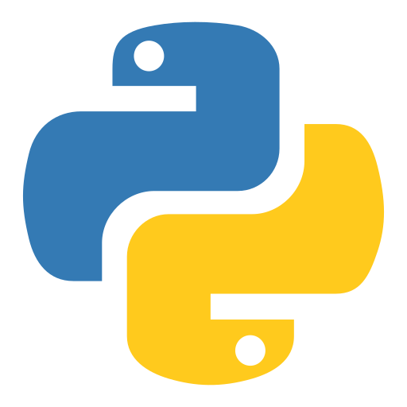

# talk.id

Este projeto visa ajudar os pacientes que passaram pelo processo de traqueostomia, inibidos de expressar qualquer tipo de comunicação verbal, e enfermeiros, num contexto hospitalar, de modo a facilitar a comunicação e interação entre ambos.

<p align="center">
  
</p>

## Table of Contents

- [Intalação](#instalação)
- [Como usar](#como-usar)
- [Desenvolvedores:](#desenvolvedores)

## Instalação

Flutter                    |         PostgreSQL        | Python
:-------------------------:|:-------------------------:|:-------------------------:
  |   | 


Passos a seguir para instalar o projeto:

1. Instalar frameworks:
   [Flutter (3.22.0)](https://github.com/flutter/flutter.git)
   [PostgreSQL](https://www.postgresql.org/download/)
   [Python (3.9.5)](https://www.python.org/downloads/release/python-395/)
> É recomendado o uso destas versões do Python e Flutter para não existir conflitos entre versões.

2. Clonar o repositório:
    Obter os ficheiros do projeto, clonando o mesmo com o seguinte comando:
    ```sh
    git clone https://github.com/mogiboop/talk.id.git
    ```

3. Criar e ativar um venv (Python):

    Criar o venv:
    ```sh
    python -m venv path_to_venv
    ```
    Ativar o venv:
    ```sh
    path_to_venv\Scripts\activate
    ```


4. Instalar packages:
    No Flutter, os packages encontram-se no ficheiro __pubspec.yaml__, na diretoria __app__. 

    Correr o comando:
    ```dart
    flutter pub get
    ```
    No Python, os packages encontram-se no ficheiro __requirements.txt__, na diretoria __app_comm__.

    Correr o comando:
    ```py
    pip install -r requirements.txt
    ```

5. Criar um ficheiro .env na root do projeto Django, diretoria __app_comm__:
    ```
    SECRET_KEY = ...
    DEBUG = ...
    DJANGO_ALLOWED_HOSTS= ...
    POSTGRES_DB_NAME = ...
    POSTGRES_USER = ...
    POSTGRES_PASSWORD = ...
    POSTGRES_HOST = ...
    POSTGRES_PORT = ...
    REDIS_HOST=...
    REDIS_PORT=...
    DJANGO_SECURE_SSL_REDIRECT=...
    WEB_PUSH_VAPID_PUB_KEY = ...
    WEB_PUSH_VAPID_PRIV_KEY = ...
    WEB_PUSH_VAPID_ADMIN_EMAIL = ...
    
    SUPERUSER_USERNAME = ...
    SUPERUSER_EMAIL = ...
    SUPERUSER_PASSWORD = ...
    SUPERUSER_FIRST_NAME = ...
    SUPERUSER_LAST_NAME = ...
    ```
    > No parâmetro __DJANGO_ALLOWED_HOSTS__ devem ser definidos os domains separado por vírgulas.

 6. Correr as aplicações:
    - No localhost:
      Completando os passos acima referidos, é possível correr o projeto no localhost.

      O próximo comando fará a migração dos modelos Django para a base de dados PostgreSQL, definida no ficheiro __.env__:
      ```py
      python manage.py migrate
      ```

      Configurar a variável __CHANNEL_LAYERS__ de acordo com o objetivo:
      - Para ambientes localhost, usar o inMemoryChannel do package channels
      - Para ambientes de produção, é recomendado ter algo mais robusto como por exemplo um servidor Redis
      
      Finalmente, o próximo comando inicializará o servidor na máquina local:
      ```py
      python manage.py runserver
      ```

      Para inicializar a mobile app, correr o próximo comando em contexto de diretoria __app__:
      ```dart
      flutter run
      ```

    - Deploy:
      Para efetuar o deploy, é necessário um web service, no qual será feito o deploy da web app e de um application server como, por exemplo, Daphne (async) e Gunicorn (sync).
      
      É também aconselhado fazer o deploy da database, pois é mais seguro e tem maior escalabilidade e performance.
      
      Todos os servidores usados na web app também podem/devem ser deployed.

      As variáveis do ambiente definidas no ficheiro .env terão que ser transportadas/copiadas para as settings do web service.

## Como usar

Após ter tudo a correr, terá sido criado, na database, um primeiro utilizador como superuser que tem todas as permissões no projeto.

Esse superuser pode criar contas para pacientes, enfermeiros e/ou superusers/admins.

De modo a tornar possível o teste do projeto, deverá ser criado pelo menos uma conta de Paciente, que será usada para efetuar o login na mobile app.


## Desenvolvedores:
Este trabalho foi desenvolvido por alunos do ISEL - Instituto Superior de Engenharia de Lisboa, em Parceria com a ESEL - Escola Superior de Enfermagem de Lisboa, sendo eles:
- Miguel Leitão A46309
- Rui Correia A48594
- Tiago Figueiredo A49154


